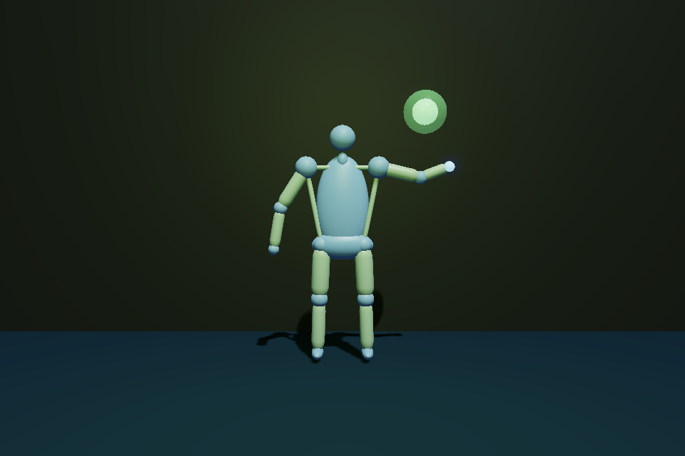

# Rééducation — mobilité guidée (portage de Mouvéo)

Démo jouable `Fichier ▸ 🎬 Démos ▸ 🎮 Jeux jouables ▸ 🎯 Rééducation`, console
`demo reeduc`, desktop `motor3derust --player --demo=reeduc`, web
[`reeduc.html`](../packaging/web/reeduc.html) (`?scene=reeduc`). Portage, le
10 septembre 2026, du prototype web
[**Mouvéo**](https://github.com/antoinequarroz/mouveo-reeducation) (React +
MediaPipe Pose + canvas 2D, ~430 lignes) sur RusteeGear.



> Avertissement repris tel quel de Mouvéo : **prototype de coaching, sans
> diagnostic ni mesure clinique**. Le patient suit les consignes de son
> professionnel de santé et s'arrête en cas de douleur, vertige ou inconfort.

## Ce que fait le jeu

Le patient se place face à la caméra (ou pilote un point au joystick), choisit
une **mission** parmi huit exercices, puis atteint des **cibles lumineuses**
avec son poignet, son genou, sa cheville ou ses hanches, et **revient en
position neutre** (hanche, pied au sol, centre) — chaque aller-retour compte
une répétition. Une séance dure au plus 60 s de temps actif (le chrono se fige
quand le corps sort du cadre) ou s'arrête à l'objectif (4 à 12 répétitions).

| Exercice | Repère suivi | Origine des cibles | Maintien | Famille |
| --- | --- | --- | --- | --- |
| Bulles latérales | poignet | épaule | — | haut du corps |
| Lumières devant | poignet | épaule | — | haut du corps |
| Chemin lumineux | poignet | épaule | — | haut du corps |
| Étoile stable | poignet | épaule | 1 s | équilibre |
| Fusée genou | genou | hanche | — | jambes |
| Feux de pas | cheville | hanche | — | jambes |
| Ascenseur | milieu des hanches | hanches | — | jambes |
| Île équilibre | cheville | hanche | 2 s | équilibre |
| Pince lumineuse *(ajout)* | bout de l'index → pouce | main suivie (21 repères) | — | main |
| Éventail *(ajout)* | bout du majeur (ouverture) | main suivie | — | main |
| Piano *(ajout)* | index, majeur, annulaire, auriculaire → pouce, tour à tour | main suivie | — | main |

Les trois cibles de chaque exercice sont des décalages en fraction de la
**longueur du membre calibrée** (épaule→coude→poignet, hanche→genou→cheville),
modulés par l'**amplitude confortable** (55 à 95 %) — exactement les motifs de
Mouvéo, donc la difficulté suit la morphologie du patient, pas des pixels.

**Avatar** : un **mannequin neutre** construit directement sur les repères
captés — tête, cou, torse et bassin (ellipsoïdes), membres en capsules,
articulations, pieds, mains et doigts — donc aux proportions exactes du
patient, sans accessoire ni personnage : c'est ce qu'on attend d'une
application de mouvement. Le bouton « Avatar » bascule sur le squelette de
bâtons (mêmes objets, affinés). Le moteur sait aussi retargeter une pose sur un
mesh skinné (`bone()`, cf. [LUA_API.md](LUA_API.md)) — les personnages
riggés essayés (héros à bouclier, ninja) ont été écartés pour cette démo.

Les **mains** n'existent pas dans Mouvéo : la page fait tourner en plus le
*Hand Landmarker* (21 repères par main, deux mains), et les deux mains suivies
viennent se poser sur les poignets du squelette, à l'échelle du corps, couleur
par doigt. Pendant les trois exercices de **doigts**, la main du côté choisi
est dessinée en grand à la place du corps, et un degré de geste `m`
(0 = neutre, 1 = geste complet : pince fermée, main grande ouverte, doigt sur
le pouce) remplace la distance à la cible — l'amplitude fixe le `m` à atteindre,
le retour se valide sous 25 %. Sans caméra, une jauge verticale se pilote au
joystick.

**Cadrage** : le corps capté est normalisé avant tout dessin — torse
hanches→épaules ramené à 0,9 m, hanches centrées à 1,35 m — donc le patient
garde la même taille à l'écran qu'il soit à 1 m ou 3 m de la caméra (les cibles,
relatives au corps, suivent) ; la caméra de jeu est reculée en conséquence.

**Qualité du suivi** : inférence à 30 Hz (15 Hz dans Mouvéo) avec repli
automatique à 15 Hz si la machine ne suit pas ; repères lissés côté moteur
(constante ~45 ms) puis interpolés à chaque frame ; un repère de visibilité
< 0,5 (hors cadre, extrapolé) n'est pas dessiné, et ses os non plus — c'est ce
qui faisait filer des cylindres hors de l'écran quand le patient était trop
près de la caméra.

**Score** : 10 points par cible + 5 par palier de 3 dans la série ; paliers
fêtés à 40 %, 70 % et 100 % de l'objectif ; **régularité** en fin de séance =
écart-type relatif des intervalles entre cibles (50–99 %) ; 1 à 3 étoiles selon
les répétitions faites ; **bilan** déclaratif douleur/fatigue (0–10) ;
**jardin de mobilité** (graine → jardin lumineux, un niveau par 150 points
cumulés) et record, conservés le temps de la session (`save.*`).

## Deux façons de jouer

| | Web `reeduc.html` (Chrome/Edge/Safari récents) | Éditeur, desktop `--player`, APK |
| --- | --- | --- |
| Entrée | **caméra** : MediaPipe Pose Landmarker + Hand Landmarker (wasm + modèles ~18 Mo, chargés d'un CDN au clic « Activer la caméra »), 33 + 2 × 21 repères à ~30 Hz | **mode démo** : le point suivi part de la position neutre et se pilote au stick tactile (souris) ou aux flèches |
| Calibration | 1,8 s de corps visible sans bouger → ancres (épaules, coudes, poignets, hanches, genoux, chevilles) figées | immédiate, silhouette virtuelle debout |
| Pause | automatique dès que le corps sort du cadre (ou pose périmée > 0,75 s) : chrono figé, consigne « Repositionnez-vous » | jamais |
| Sans caméra | bascule d'elle-même en mode démo (refus, absence, CDN inaccessible) | — |

Le mode est **verrouillé au départ de la séance** (`pose.ok` à l'appui sur
▶ Commencer) : une caméra qui se coupe en cours de séance met en pause, elle ne
change pas de mode.

## Comment c'est construit (et ce qui diffère de Mouvéo)

Tout le gameplay est **en donnée de scène** — objets, scripts Lua, widgets HUD
(`Scene::reeducation_demo`, [src/scene/demos/reeducation.rs](../src/scene/demos/reeducation.rs)) :
la scène s'exporte, s'édite dans l'inspecteur (amplitudes, couleurs, textes,
boutons) et tourne à l'identique sur les cinq cibles, sur les deux backends
Lua (test `reeducation_scripts_run_on_the_web_backend`).

```text
reeduc.html ── caméra ──▶ MediaPipe ──▶ set_pose_landmarks(33 × 4)   (JS, web seulement)
                                              │
                               AppState::pose (app/pose.rs) ── vieillit à chaque pas
                                              │
                                   table Lua `pose` (script_ctx, 2 backends)
                                              │
   « Séance » (script directeur) ── save.rd_* ──▶ Cible / Halo / Point suivi / 13 Repères / 12 Os
                                              │
                                   hud_text(...) ──▶ widgets Text ; Button ──▶ on_event("hud:…")
```

| Mouvéo | RusteeGear | Pourquoi |
| --- | --- | --- |
| squelette 2D dessiné sur la vidéo miroir | mannequin 3D neutre construit sur les repères (ellipsoïdes + capsules, orientés par script), dans le plan `z = 0`, caméra de jeu fixe face au patient ; la vidéo reste en vignette miroir (HTML) | le moteur rend de la 3D, pas un flux vidéo ; la vignette garde le retour visuel « je me vois » |
| état React (`useRef`/`useState`), un composant de 430 lignes | machine à états dans un script Lua « directeur », état numérique dans `save.*` (préfixe `rd_`), les autres objets le relisent le même tick | pas de callbacks dans l'API script (un chunk par objet et par pas), et `save` est le seul état partagé |
| HUD React + Tailwind (score, série, chrono, consigne, bilan, sliders) | widgets HUD déclaratifs (`hud_text` pour les textes, `Button` → `hud:<action>`), pain/fatigue par boutons +1 | pas de sliders parmi les widgets ; les boutons restent visibles à tous les stades (ils n'agissent qu'au bon stade) |
| voix de synthèse (`speechSynthesis`), vibration | `vibrate()` (journalisé), pas de voix | pas d'API voix dans le moteur — à brancher côté page si besoin |
| `localStorage` (historique 30 séances, programme thérapeute) | `save.*` le temps de la session ; pas d'espace thérapeute séparé (les réglages sont les boutons) | la persistance web du moteur ne couvre pas encore `save.*` (cf. LUA_API.md) |
| démo tactile : un clic = cible atteinte | mode démo : point piloté au stick/flèches, le membre suit (coude, genou) | jouable et **testable** sans caméra, sur toutes les cibles |

Coordonnées : `x`, `y` MediaPipe normalisés (0..1, `y` vers le bas, image non
miroir) → monde `x = (0,5 − x) · 4 m`, `y = (1 − y) · 3,2 m` — la droite du
patient apparaît à droite de l'écran, comme dans une glace
(`reeducation::pose_to_world`). Seuil de cible : `max(0,2 m ; 16 % du membre)`,
anti-rebond 0,65 s entre deux cibles, comme dans l'original.

## Fichiers

- [src/app/pose.rs](../src/app/pose.rs) — `PoseFrame` (33 repères, fraîcheur), `HandFrame` (2 × 21 repères), `AppState::set_pose`/`set_hands`.
- [src/scene/import.rs](../src/scene/import.rs) — directions d'os imposées (`compute_joint_matrices_into_with`), `SceneObject::bone_dirs`, fonction Lua `bone()` ; [src/assets.rs](../src/assets.rs) — modèles `embedded://`.
- [src/lib.rs](../src/lib.rs) — export wasm `set_pose_landmarks`, `?scene=reeduc` / `--demo=reeduc`.
- [src/app/scripting.rs](../src/app/scripting.rs), [scripting_web.rs](../src/app/scripting_web.rs) — table `pose` (cf. [LUA_API.md](LUA_API.md)).
- [src/scene/demos/reeducation.rs](../src/scene/demos/reeducation.rs) — scène, scripts, widgets.
- [packaging/web/reeduc.html](../packaging/web/reeduc.html) — page caméra (publiée par `pages.yml` à côté de `index.html`).
- [examples/gen_reeduc_preview.rs](../examples/gen_reeduc_preview.rs) — régénère l'image ci-dessus (rendu headless, GPU requis).
- Tests : `app::pose`, `scripting::tests::script_reads_pose_landmarks_via_the_pose_table`,
  `scripting_web::tests::differential::{pose_table_matches_between_backends, reeducation_scripts_run_on_the_web_backend}`,
  `simulation::tests::reeducation_{demo_mode_is_playable_with_the_joystick_until_the_goal, camera_mode_calibrates_then_counts_reps_and_pauses_when_the_body_is_lost}`,
  `scene::demos::tests::reeducation_*`, `editor::hud::tests::reeducation_hud_glyphs_are_covered_by_the_embedded_fonts`.

## Limites et suites possibles

- **Caméra = web seulement.** Le moteur natif n'embarque ni capture caméra ni
  inférence ; un client desktop/APK pourrait recevoir les repères d'un petit
  service local (même contrat `33 × 4` flottants) via le pont de pilotage.
- **Pas de persistance** de l'historique entre deux ouvertures (cf. `save.*`
  sur le web) ni d'espace thérapeute avec code patient — à ajouter côté scène
  (widgets) et côté moteur (persistance `save.*` en `localStorage`).
- **Précision** : celle de MediaPipe « lite » à 15 Hz, en 2D (la profondeur `z`
  est exposée mais inutilisée, comme dans Mouvéo) — aucune valeur clinique.
- Le suivi caméra n'a pas été essayé sur un vrai patient dans cette session :
  la page a été vérifiée sans caméra (mode démo) et le mode caméra par des poses
  synthétiques dans les tests.
