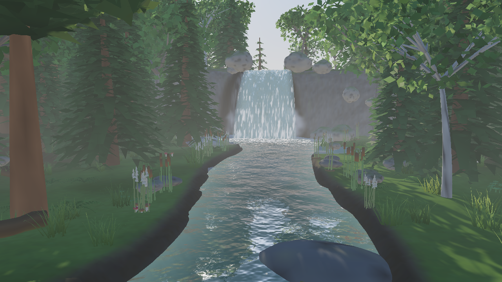

# Rivière & cascade — vitrine de rendu (eau animée, forêt, brume)



Démo `Fichier → 🎬 Démos → 🌐 Modes multijoueur → 🏞 Rivière & cascade`
(console : `demo riviere` ; desktop : `--demo=riviere` ; web : `?scene=riviere`,
en ligne sur <https://water.loicberthod.ch>). Une vallée boisée en U, une
rivière sinueuse qui descend d'un plateau par une cascade dans un bassin, une
forêt dense sur les deux versants, de la brume au pied de la chute. Pas de
combat : on se promène (joystick / WASD, Espace pour sauter).

## Multijoueur (14 septembre 2026)

La démo est un monde en ligne à part entière, sur le même serveur autoritaire
que le hameau MMORPG (`src/bin/server.rs`) — pas un second protocole : le
**code de salon** décide seul quel monde un salon charge
(`net::protocol::RIVIERE_LOBBY = "riviere"`, `app::multiplayer::WorldKind`),
sans nouveau champ de protocole ni bump de `PROTOCOL_VERSION`. Un salon dont
le code vaut exactement `RIVIERE_LOBBY` construit `Scene::riviere_demo()`
(`bin/server.rs::Room::for_world`) au lieu du hameau embarqué ; tout autre
code garde le hameau, comme avant.

Côté client, `AppState::world` retient le monde **actuellement chargé**
localement (posé par `load_riviere_demo`/`use_embedded_scene*`) : un code de
salon vide au moment de se connecter (fenêtre Multijoueur de l'éditeur, ou
écran d'accueil « Jouer en ligne / seul ») rejoint alors le salon partagé du
monde en cours plutôt que toujours `DEFAULT_LOBBY`
(`app::network_client::resolve_lobby_code`). Charger la démo Rivière avant de
cliquer « Se connecter » suffit donc à retrouver les autres visiteurs de ce
monde, sans rien à choisir de plus. Limite assumée : pas de salon Rivière
*privé* avec un code arbitraire en v1 (comme le hameau, tous les visiteurs se
retrouvent dans ce salon unique).

**En ligne depuis le 14 septembre 2026**, vérifié à chaque étape :

- En local d'abord : serveur local + deux clients éditeur pilotés (`--pilot`),
  chacun `demo riviere` puis `pilot net connect ws://127.0.0.1:7777` avec un
  salon vide — les deux se retrouvent dans « riviere » et se voient (objet
  `Joueur réseau <nom>` visible de chaque côté).
- Puis en production : le serveur de `ws.loicberthod.ch` a été redéployé avec
  ce binaire (24 tests réseau rejoués *sur le VPS* avant le remplacement,
  ancien binaire sauvegardé, coupure de service ~2 s confirmée par
  l'utilisateur au préalable). Vérifié avec `cargo run --release --example
  smoke_vps wss://ws.loicberthod.ch` (hameau intact) et deux vrais clients
  connectés sur `wss://ws.loicberthod.ch`, salon « riviere ».
- Enfin sur le site : `water.loicberthod.ch` redéployé sans le garde-fou solo
  (`#[cfg(target_arch = "wasm32")]` retiré de `lib.rs`) et vérifié avec **deux
  vrais onglets Chrome** ouverts sur le site en ligne, chacun cliquant
  « Jouer en ligne » indépendamment — connectés, se voient.

**⚠️ Piège opérationnel** (pertinent pour quiconque retouche le serveur) : le
checkout git géré par `scripts/deploy_vps.sh` sur le VPS (`~/rusteegear-server`)
est resté sur l'ancien commit `main` — seul le **binaire compilé** a été
remplacé (build fait à la main dans `/mnt/data/riviere-mp-build/`, rsyncé
depuis ce dépôt, `feat/platformer-2d` mélangeant ce travail à du code non
trié d'une autre session). Un `deploy_vps.sh` normal (ou tout `git pull` +
rebuild dans ce dossier) écraserait ce binaire par l'ancien tant que ce
travail n'est pas mergé dans `main` — vérifier après coup que le salon
`riviere` route encore vers la vallée avant de considérer un déploiement
« normal » comme neutre.

## Ce qui a été ajouté au moteur

### Composant « Surface d'eau » (`SceneObject::water`)

Inspecteur → Matériau → **Surface d'eau**. Trois genres (`WaterKind`) :

| Genre | Usage | UV attendus |
| --- | --- | --- |
| Rivière / lac | plan d'eau courante ou calme | `u` = abscisse le long du courant (m), `v` = position transversale (m) — le motif défile vers +u |
| Cascade | nappe tombante | `u` transversal, `v` = longueur parcourue (m) — traînées étirées, défilement vers +v |
| Brume / embruns | plan ou impostor (`MeshKind::Billboard`) | 0..1 — nuage d'opacité animé, fondu vers les bords |

Réglages : **Courant** (vitesse de défilement), **Échelle** (finesse des
vaguelettes), **Écume** (quantité). Se combine avec **Opacité < 1** pour laisser
voir le lit (passe transparente).

Le rendu (`main.wgsl`, `shade_water`) est entièrement procédural — aucune
texture ni carte de normales : bruit de valeur à quatre octaves animé, dérivé
en normale dans un repère tangent reconstruit des dérivées écran ; Fresnel de
Schlick entre le corps d'eau (teinte de l'objet × profondeur) et le reflet du
ciel (dégradé horizon/zénith de la scène, berges sombres sous l'horizon) ;
éclats du soleil ; écume seuillée. Le temps d'animation est l'horloge du
renderer (`CameraUniform::eye.w`) : l'eau bouge aussi dans l'éditeur hors Play,
et reste figée en rendu headless (goldens déterministes ; `Renderer::set_anim_time`
pour un aperçu).

**Réflexion planaire** (`Renderer::render_reflection_pass`) : quand la scène
contient une surface « rivière », la scène opaque (ciel, statiques, skinnés)
est redessinée depuis la caméra **miroir** (symétrique par rapport au plan
d'eau, altitude lue au sommet de nappe le plus proche de la cible caméra) dans
une texture demi-résolution ; les fragments sous le plan sont rejetés (le lit
ne se reflète pas). Les objets eau lisent cette texture à leurs coordonnées
écran (elle remplace l'albédo, groupe 3), déformée par les vaguelettes et
mélangée au ciel selon le Fresnel — la forêt et la falaise se reflètent
réellement. Coût : une passe de plus (≈ la passe principale à ¼ des pixels).

**Atmosphère** (`Sky`) : `sun_glow` (disque + halo du soleil dans le ciel,
teinté par la lumière, passe dans le bloom), `fog_height_base` /
`fog_height_falloff` (brouillard **de hauteur** : la brume stagne dans la
vallée et s'éclaircit sur les crêtes ; l'horizon du ciel se voile de la couleur
du brouillard). Tous à 0 par défaut : aucune scène existante ne change.

**Masques par sommet** : le maillage porte une couleur `COLOR_0` lue comme
R = écume autorisée, G = profondeur relative (rivière) ou distance au bord
(cascade). L'importeur glTF lit désormais `COLOR_0` (multiplié par la teinte du
matériau, comme la spec) — sans effet sur les packs existants, qui n'en ont pas.

### Génération des assets (sans Blender)

```bash
python3 scripts/gen_riviere_cascade.py
```

Produit `assets/models/riviere/` : le terrain (grille 221² sommets, vallée,
plateau, falaise, lit et bassin creusés), son **albédo cuit** 2048² (herbe,
humus des sous-bois, roche sur les pentes, galets mouillés dans le lit, face de
berge sombre — une seule texture par objet dans le moteur, le mélange est fait à
la génération), et les trois nappes d'eau (amont, cascade balistique à deux
feuillets, bassin + aval).

```bash
python3 scripts/gen_riviere_vegetation.py
```

Végétation et rochers **générés** (numpy, couleurs par sommet) : épicéas à
verticilles de lames d'aiguilles et houppes (≈ 6 000 triangles, variante LOD
≈ 900), pin sylvestre, hêtres et bouleaux à ≈ 1 800 feuilles en losange dans
une couronne ellipsoïdale (normales « centre → feuille » pour un ombrage
arrondi), touffes d'herbe, fougères, rochers érodés (icosphère déplacée par
bruit, fissures, lichen, mousse sur les faces tournées vers le haut), galets
mouillés, tronc mort. Planche d'aperçu :
`cargo run --example gen_riviere_assets_preview --profile dev-fast`.

`Scene::riviere_demo` (`src/scene/demos/riviere.rs`) lit la hauteur du sol dans
le maillage importé (`terrain_height`) pour poser la forêt (modèles détaillés
au bord de la rivière côté caméra, `_lod` ailleurs), le sous-bois, les berges
(roseaux et pampas **animés** du pack Blender, massettes, herbes hautes,
galets), les rochers de rivière et de falaise, brumes basses et une faune
discrète — tirage déterministe, la scène est identique à chaque chargement.
Sur le web, `assets/models/riviere/` est compilé dans le `.wasm`
(`embedded://riviere/…`, ≈ 12 Mo). Les formules du chenal sont recopiées du script
Python ; le test `riviere_demo_plants_nothing_in_the_water` garantit qu'elles
restent synchronisées.

## Limites (honnêtes)

- Pas de normal mapping ni de réfraction ; la réflexion est planaire (un seul
  plan d'eau par image : la rivière amont, 9 m plus haut, retombe sur le ciel).
- Feuillages en triangles colorés par sommet (pas de textures alpha) : lisibles
  à distance et en mouvement, plus grossiers de près.
- Aperçu : `cargo run --example gen_riviere_preview --profile dev-fast`
  (GPU requis) écrit `docs/img/riviere_cascade_preview.png`.

## Mise en ligne (water.loicberthod.ch)

Site statique servi par Caddy sur le VPS partagé (même patron que
`mouveo.loicberthod.ch`, cf. `checkVPS/VPS-DEPLOY-GUIDE.md`, chemin B) :

```bash
./packaging/build_web.sh                      # wasm32 + wasm-bindgen + wasm-opt → packaging/web/pkg/
# dist = index.html (avec <script> qui force ?scene=riviere ET le commit
# substitué au placeholder __RUSTEEGEAR_COMMIT__, cf. packaging/web/index.html),
# favicon.svg, pkg/
rsync -az --delete -e "ssh -i ~/.ssh/loicberthodvps" dist/ ubuntu@<vps>:/mnt/data/water/dist/
```

Bloc Caddy `water.loicberthod.ch { root * /mnt/data/water/dist … file_server }`
ajouté le 11 septembre 2026 (sauvegarde `Caddyfile.bak.20260911-204518`). Le
`.wasm` pèse ≈ 36 Mo (moteur + assets de la vallée embarqués) ; premier
chargement ≈ 10-20 s selon la connexion. WebGPU requis (Chrome/Edge 113+,
Safari 18+). Sur un onglet en arrière-plan, le navigateur suspend
`requestAnimationFrame` : la page reste sur « Initialisation du GPU… » tant
que l'onglet n'est pas visible — ce n'est pas un blocage.

## Performances

Benchmark headless (`cargo run --example bench_riviere --profile dev-fast`,
`BENCH_RES=2560x1440`) : ≈ 14 ms/image pour la scène complète sur M5 Pro,
dont ≈ 60 % pour les arbres. La scène est limitée par le **surdessin des
feuillages** (fragments × MSAA × PCF 5×5), pas par les triangles : d'où les
feuilles moins nombreuses mais plus grandes, les variantes `_lod`, et le tri
des objets du plus proche au plus lointain depuis le départ du joueur (le
test de profondeur précoce rejette la plupart des fragments cachés). Mode
joueur natif (MSAA 4×, Retina) : ≈ 50 FPS en `dev-fast`, 120 FPS en build
optimisé.
