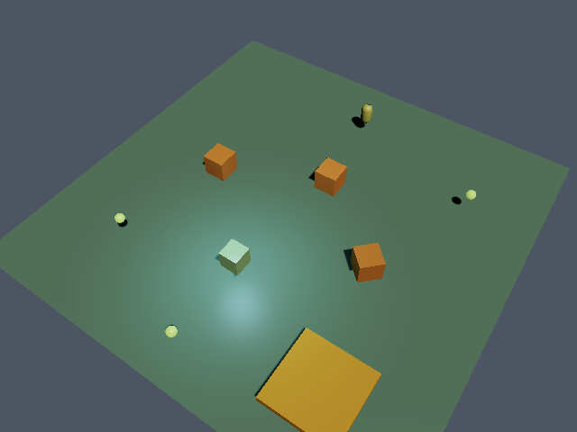

# First Game — le projet exemple de RusteeGear

Une scène minuscule, comprise en quelques secondes, pour un premier contact
avec l'éditeur. Elle contient exactement :

| Objet | Rôle |
| --- | --- |
| Sol | plan statique (collision) |
| Joueur | capsule pilotable — flèches/WASD, **Espace** = saut |
| Caisse 1-3 | obstacles statiques |
| Cube tournant | objet animé par script Lua (45°/s) |
| Zone d'éveil | zone déclencheuse : devient verte quand on marche dessus |
| Pièce 1-3 | l'objectif : les ramasser toutes (le chrono se fige quand c'est fait) |

Plus une lumière directionnelle et une lumière ponctuelle bleutée au-dessus du
cube tournant.

## Ouvrir la scène

1. Lancer l'éditeur : `cargo run --profile dev-fast`
2. Menu **📂 Ouvrir…** → sélectionner `examples/first_game/scene.json`
3. Cliquer **Play** — déplacer le joueur, ramasser les 3 pièces dorées.

## À propos des scripts

Dans RusteeGear, un script Lua vit **dans l'objet** (champ « Script » de
l'inspecteur), pas dans un fichier. Le dossier [scripts/](scripts/) contient la
copie lisible des deux scripts de la scène, pour lecture et copier-coller :

- [rotating_object.lua](scripts/rotating_object.lua) — rotation continue (`obj.ry = obj.ry + 45 * dt`)
- [zone_signal.lua](scripts/zone_signal.lua) — réaction à l'entrée/sortie d'une zone (`obj.triggered` / `obj.exited`)

Pour les modifier : sélectionner l'objet, éditer le champ Script dans
l'inspecteur, relancer Play.

## Notes

- La scène n'utilise que des primitives (aucun asset externe) : elle s'ouvre
  depuis n'importe quel clone du dépôt, sans import préalable.
- Le format est un `Scene` JSON standard (`"version": 2`) — le même que
  produit **💾 Enregistrer sous…**. Ce dossier est un dossier de **données** :
  Cargo ne le compile pas (aucun fichier `.rs`).
- Tutoriel pas-à-pas : `docs/FIRST_GAME.md` à la racine du dépôt.
